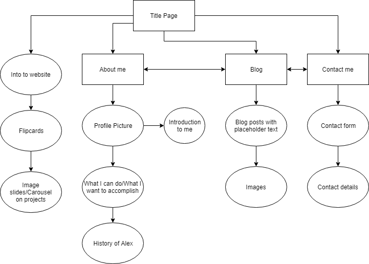

#Alex Kentwell's Portfolio Website
Current live site: https://stoic-aryabhata-457830.netlify.com/
Github: https://github.com/Alkex1/Portfolio-Website

##Purpose of my portfolio website
The purpose of my portfolio website is to give those that visit it, some insight into me as a person, and some of the things that I have done, along with showcase my ability to make a functioning website.

##Functionality/Features

###Features
1. Navigation bar - Simple navigation bar that allows the user to quickly and easily swap from one page to another, which appears as a drop-down that is triggered by the user clicking on the Menu or hamburger icon, or as a choice of the different websites as buttons along the top of the webpage.
2. Carousel Slideshow -  At the bottom of the page, in which I have added some of the projects we have worked on in the Coder Academy course, with arrows on the right and left hand side of the picture that allow for the user to swap to the next image if they want to.
3. Flipcard -  At the top of the page which rotates an image 180degrees to show the user information on the back.
4. Hover images - When the user's cursor hovers over any of the five blog posts, a border appears around that section of the page, and the text becomes larger.
5. Contact form - The last page in my website has a simple contact form with user-input text-box's if they would like to get in contact with me, including separate 'Subject', 'Your Name' and 'Question' sections for them to fill out. This is followed by my contact details below the form if they would prefer not to use the form.

###Functionality
* The navbar swaps between the two varieties depending on if the users view screen is below 1000px (showing the drop-down menu), or above 1000px (appearing as the options along the top) in order to have it easier for users on mobile to access each menu function, and users on a desktop computer to have less steps to navigate between the pages.
* The hover images on the blog page are there to improve the users visual experience, making it easier to focus on the specific post that they are currently reading/looking at.
* The About me and Blog post sites both swap the images that are on the same line as the text from the side when screen width is above 370px, to above the text when the screen width is below 370px. This is done to make the text more readable in situations where they have a smaller screen width.

##Sitemap

##Techstack
* HTML
* CSS
* JavaScript - used for the Carousel on title page.
* Netlify for hosting

##Target Audience
The target audience for my website would most likely be potential employers in the future or people interested in seeing what Coder Academy students are capable of in a short span of time learning the basics of html and css, and a fair amount of Dr. google.